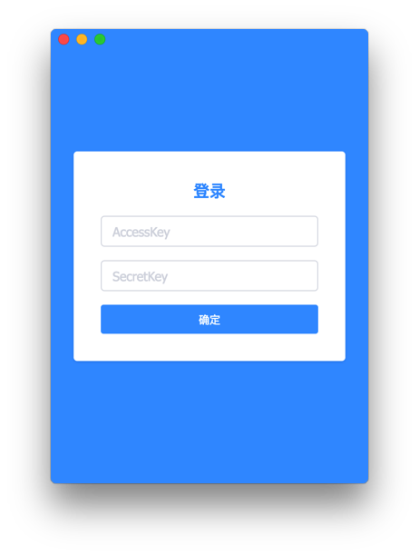
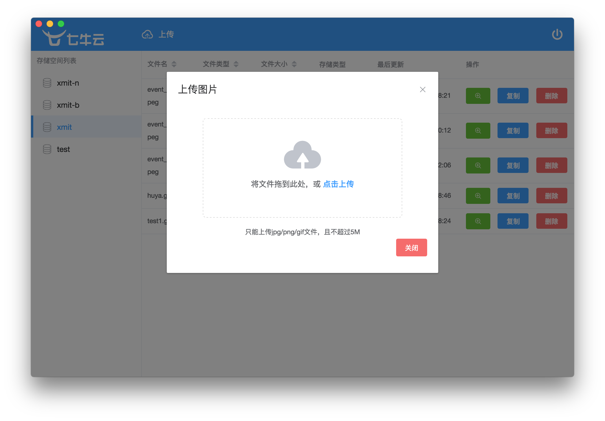

# 七牛客户端

### 项目说明

基于 electron-vue + element ui 七牛客户端

### 项目截图






### 项目目录

```
├── src
│   ├── index.ejs
│   ├── main                    // 主进程
│   │   ├── config              // 主进程相关配置
│   │   │   └── menu.js
│   │   ├── index.dev.js        // 主进程核心代码
│   │   └── index.js
│   └── renderer                // renderer进程
│       ├── App.vue
│       ├── assets              // 静态文件
│       │   ├── data.png
│       │   ├── image.js
│       │   ├── logo-blue.png
│       │   ├── logo-white.png
│       │   └── upload.png
│       ├── components          // 组件
│       │   ├── BucketList.vue 
│       │   ├── CreateBucket.vue
│       │   ├── Header.vue
│       │   ├── Layout.vue
│       │   ├── List.vue
│       │   ├── Login.vue
│       │   ├── Preview.vue
│       │   └── UploadImage.vue
│       ├── main.js
│       ├── router              // 路由
│       │   └── index.js
│       ├── service             // api
│       │   ├── api.js
│       │   ├── getData.js
│       │   └── http.js
│       ├── store               // vuex
│       │   ├── getters.js
│       │   ├── index.js
│       │   └── modules
│       │       └── app.js
│       ├── styles              // 样式
│       │   ├── element-ui.scss
│       │   └── index.scss
│       └── utils               // 公共方法
│           └── common.js
└── static
```

### 构建应用

``` bash
# 安装依赖
npm install

# 热加载服务运行在 localhost: 9080
npm run dev

# 打包项目
npm run build
```

### 赞助我

如果觉得这些内容不错，请我喝杯咖啡吧。


